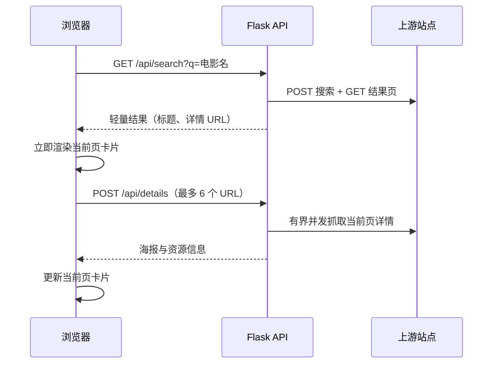

# Anything

一个轻量的电影检索 Web 应用。前端会先展示搜索结果标题，再按当前页并行加载海报与资源信息，避免等待全部详情完成。

> 本项目用于 Web 开发、HTML 解析和渐进加载的学习演示。第三方内容及链接由上游站点提供，请遵守其使用条款、robots.txt 和所在地法律法规。

## 功能

- 中文电影名称搜索
- 深色电影典藏风格的响应式界面
- 桌面端三列布局，每页最多六项
- 当前页海报与详情并行渐进加载
- 搜索结果和详情的进程内 TTL 缓存
- 磁力、ED2K 与 torrent 链接统一展示
- 详情 URL 白名单和批量大小限制

## 项目结构

```text
Anything/
├─ backend/
│  ├─ app.py          # Flask 应用工厂与本地入口
│  ├─ routes.py       # HTTP API 路由与输入校验
│  ├─ services.py     # 搜索、并发详情加载与缓存编排
│  ├─ upstream.py     # 上游 HTTP 客户端与 URL 白名单
│  ├─ parsers.py      # 纯 HTML 解析逻辑
│  ├─ cache.py        # 线程安全的有界 TTL 缓存
│  └─ config.py       # 可公开提交的应用常量
├─ frontend/
│  ├─ index.html      # 页面结构
│  └─ assets/
│     ├─ app.js       # 搜索、分页和渐进加载
│     └─ styles.css   # 页面样式
├─ tests/
│  ├─ test_api.py
│  ├─ test_parsers.py
│  └─ test_upstream.py
├─ .gitignore
├─ requirements.txt
└─ README.md
```

## 架构和请求流程



## 本地运行

### 1. 创建虚拟环境

Windows PowerShell：

```powershell
python -m venv .venv
.\.venv\Scripts\Activate.ps1
pip install -r requirements.txt
```

### 2. 启动应用

前端与 API 由同一个 Flask 应用提供，避免生产环境跨域配置：

```powershell
python -m backend
```

浏览器访问：<http://127.0.0.1:8000>，健康检查地址为 <http://127.0.0.1:8000/healthz>。如需使用单独的开发前端，可通过 `CORS_ORIGINS` 环境变量显式允许来源，参考 `.env.example`。

### 3. 使用生产容器

```powershell
docker build -t anything:local .
docker run --rm -p 8000:8000 anything:local
```

容器以非 root 用户运行，并由 Gunicorn 在 `8000` 端口同时提供前端和 API。

## API

### 搜索

`GET /api/search?q=关键词`

快速返回轻量结果，不等待详情页：

```json
{
  "success": true,
  "keyword": "阿凡达",
  "count": 5,
  "results": [
    {
      "title": "阿凡达：火与烬",
      "detailUrl": "https://www.dygangs.me/ys/20260329/59392.htm",
      "posterUrl": "",
      "downloadLinks": [],
      "detailsLoaded": false
    }
  ]
}
```

### 当前页详情

`POST /api/details`

请求体最多包含六个受信任上游详情 URL：

```json
{
  "urls": ["https://www.dygangs.me/ys/20260329/59392.htm"]
}
```

## 测试

```powershell
python -m unittest discover -s tests -v
```

测试覆盖 API 输入校验、搜索跳转、搜索/详情 HTML 解析、相对链接归一化和详情批量顺序。

## 性能设计

- 搜索接口只完成搜索 POST 和结果页 GET。
- 详情只抓取当前可见的六项，并使用最多六个工作线程。
- 搜索列表缓存 5 分钟；详情缓存 30 分钟；失败详情短缓存 2 分钟。
- 缓存均有容量上限，并且只存在于当前 Python 进程中。
- 多进程或多实例部署时，可将缓存替换为 Redis 等共享缓存。

## 安全与 Git 卫生

- 仓库不需要 API 密钥或账号密码。
- 不要提交 `.env`、私钥、证书、编辑器配置、虚拟环境、日志或本地数据库。
- `.gitignore` 已覆盖常见敏感文件和开发产物，但提交前仍应检查：

```powershell
git status --short
git diff --cached
```

- 详情接口仅接受配置中的 HTTPS 上游域名，并限制每批最多六个 URL。
- 前端使用 DOM API 和协议白名单渲染第三方内容。
- 生产镜像使用 Gunicorn、非 root 用户、同源 API、健康检查及基础安全响应头；公网部署仍应在 Cloudflare/Azure 层配置速率限制和网络策略。

## CI/CD 与 Azure 部署

- `.github/workflows/ci.yml`：在 Pull Request 和 `master` push 上执行 Python 编译、单元测试、开发 URL 检查和生产镜像构建。
- `.github/workflows/deploy.yml`：CI 成功后通过 GitHub OIDC 登录 Azure，在 ACR 中构建 commit SHA 镜像，更新 Azure Container Apps revision，并验证 `/healthz`。
- Azure 资源、GitHub Environment、OIDC、Cloudflare 域名和回滚配置参见 [`docs/azure-cicd.md`](docs/azure-cicd.md)。

部署前不要提交任何 Azure 密钥；流水线只使用短期 OIDC 凭据。

## 已知限制

- 搜索依赖第三方页面结构、域名和可用性，上游改版可能导致解析失效。
- 部分海报服务器可能启用防盗链，加载失败时前端会显示占位图。
- 当前缓存为单进程内存缓存，重启后会清空。
