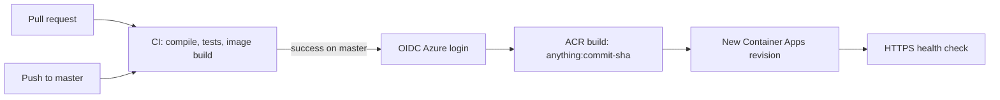

# Azure Container Apps CI/CD

Anything is shipped as one immutable container: Gunicorn serves the Flask API and the static frontend on port `8000`. GitHub Actions tests every change, builds the image in Azure Container Registry (ACR), updates Azure Container Apps, and verifies `/healthz`.

## Delivery flow



The deployment workflow uses the exact commit SHA tested by CI. Images are never selected by a mutable `latest` tag. Production deployments are serialized through the `production` GitHub Environment.

## Required Azure resources

Create these resources in one resource group:

- Azure Container Registry, Basic SKU is sufficient initially.
- Azure Container Apps environment.
- Azure Container App with external ingress and target port `8000`.
- A system-assigned managed identity on the Container App with `AcrPull` on the registry.
- A user-assigned managed identity (or Entra application/service principal) with a GitHub federated credential.

The deploy identity needs permission to run ACR builds and update the Container App. Assign the narrowest roles practical for the target resource group, typically `Contributor` during initial setup; reduce this to resource-scoped roles after deployment is proven. It does not need an Azure client secret.

### Suggested names

| Setting | Example |
|---|---|
| Resource group | `rg-anything-prod` |
| ACR | `acranythingprod` |
| Container Apps environment | `cae-anything-prod` |
| Container App | `ca-anything-prod` |
| Region | `southeastasia` |

For the lowest idle cost, start with `0.25` CPU, `0.5Gi` memory, minimum replicas `0`, maximum replicas `1`, external HTTPS ingress, and target port `8000`. Use `/healthz` for startup/readiness/liveness probes. Increase to `0.5` CPU and `1Gi`, or keep one warm replica, only if cold starts or load require it.

## Configure GitHub OIDC

Create a federated credential on the deployment identity for the GitHub Environment subject. Use the **exact subject emitted by the OIDC verification workflow**. Depending on GitHub's current immutable-identity format, it may look like:

```text
repo:IdiotYi@<owner-id>/Anything@<repository-id>:environment:production
```

Do not assume the older `repo:IdiotYi/Anything:environment:production` form: compare Azure's federated credential with the `subject claim` printed by `azure/login`.

Issuer and audience:

```text
issuer: https://token.actions.githubusercontent.com
audience: api://AzureADTokenExchange
```

In GitHub, create an Environment named `production`. Add required reviewers if production should need approval. Store these as **Environment secrets**:

| Secret | Value |
|---|---|
| `AZURE_CLIENT_ID` | Deployment identity client ID |
| `AZURE_TENANT_ID` | Azure tenant ID |
| `AZURE_SUBSCRIPTION_ID` | Azure subscription ID |

Store these as **Environment variables**:

| Variable | Example |
|---|---|
| `AZURE_RESOURCE_GROUP` | `rg-anything-prod` |
| `AZURE_ACR_NAME` | `acranythingprod` |
| `AZURE_CONTAINER_APP` | `ca-anything-prod` |

Do not create `AZURE_CLIENT_SECRET`; `azure/login` obtains a short-lived token through GitHub OIDC.

## Container App registry access

Enable the Container App's system identity and grant it ACR pull access:

```bash
PRINCIPAL_ID=$(az containerapp identity assign \
  --resource-group rg-anything-prod \
  --name ca-anything-prod \
  --system-assigned \
  --query principalId --output tsv)

ACR_ID=$(az acr show \
  --resource-group rg-anything-prod \
  --name acranythingprod \
  --query id --output tsv)

az role assignment create \
  --assignee-object-id "$PRINCIPAL_ID" \
  --assignee-principal-type ServicePrincipal \
  --role AcrPull \
  --scope "$ACR_ID"

az containerapp registry set \
  --resource-group rg-anything-prod \
  --name ca-anything-prod \
  --server acranythingprod.azurecr.io \
  --identity system
```

The first Container App can be created with a temporary public image. The first successful CD run replaces it with the immutable Anything image from ACR.

## GitHub workflow behavior

- `.github/workflows/ci.yml` runs for pull requests, pushes to `master`, and manual dispatches.
- `.github/workflows/deploy.yml` runs only after successful `CI` completion on `master`.
- Manual deployment is available from `master` for recovery and reruns tests before touching Azure.
- A failed health check fails the workflow; Azure retains revision history for rollback.

Recommended branch protection for `master`:

1. Require pull requests.
2. Require the `Test and build` check.
3. Require the branch to be up to date.
4. Block force pushes and deletion.

## Local verification

```bash
python -m pip install -r requirements.txt
python -m unittest discover -s tests -v
docker build -t anything:local .
docker run --rm -p 8000:8000 anything:local
```

Verify:

```bash
curl --fail http://127.0.0.1:8000/healthz
```

Then open <http://127.0.0.1:8000/>.

## Cloudflare and custom domain

After Azure deployment succeeds on its generated FQDN:

1. Add `anything.idiotyi.top` as an Azure Container Apps custom domain.
2. Add the Azure-provided validation TXT record in Cloudflare.
3. Add a CNAME from `anything` to the Container App FQDN, initially DNS-only.
4. Issue or bind the Azure managed certificate.
5. After Azure HTTPS works, optionally enable the Cloudflare proxy.
6. Set Cloudflare SSL/TLS to **Full (strict)**, never Flexible.

Cloudflare settings are intentionally outside the deployment workflow so DNS and certificate changes cannot be made by an application commit.

## Rollback

List revisions:

```bash
az containerapp revision list \
  --resource-group rg-anything-prod \
  --name ca-anything-prod \
  --output table
```

With single-revision mode, update the app back to the image SHA of a known-good commit. With multiple-revision mode, move traffic back to the previous healthy revision. Keep image tags in ACR for the desired rollback retention period.

## Runtime configuration

| Environment variable | Default | Purpose |
|---|---|---|
| `PORT` | `8000` | Local development server port; the production image binds to 8000 |
| `HOST` | `127.0.0.1` | Local development bind address |
| `CORS_ORIGINS` | empty | Comma-separated origins for a separately hosted development UI |
| `UPSTREAM_BASE_URL` | `https://www.dygangs.me` | Upstream search base URL |

No application secret is currently required. Never store Azure credentials in `.env` or source control.
